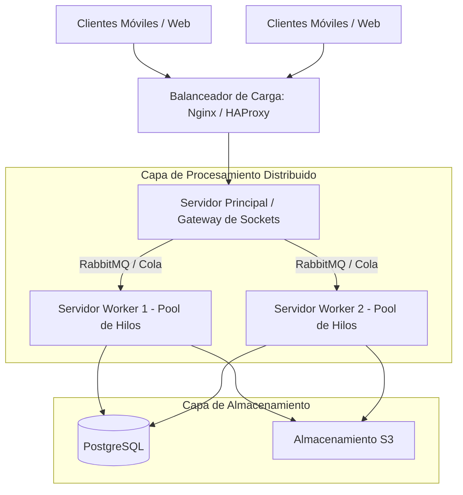

```mermaid
graph TD
    Client1["Clientes Móviles / Web"] --> LB["Balanceador de Carga: Nginx / HAProxy"]
    Client2["Clientes Móviles / Web"] --> LB

    LB --> Server["Servidor Principal / Gateway de Sockets"]

    subgraph "Capa de Procesamiento Distribuido"
        Server -->|RabbitMQ / Cola| Worker1["Servidor Worker 1 - Pool de Hilos"]
        Server -->|RabbitMQ / Cola| Worker2["Servidor Worker 2 - Pool de Hilos"]
    end

    subgraph "Capa de Almacenamiento"
        Worker1 --> DB[("PostgreSQL")]
        Worker2 --> DB
        Worker1 --> S3["Almacenamiento S3"]
        Worker2 --> S3
    end
```
